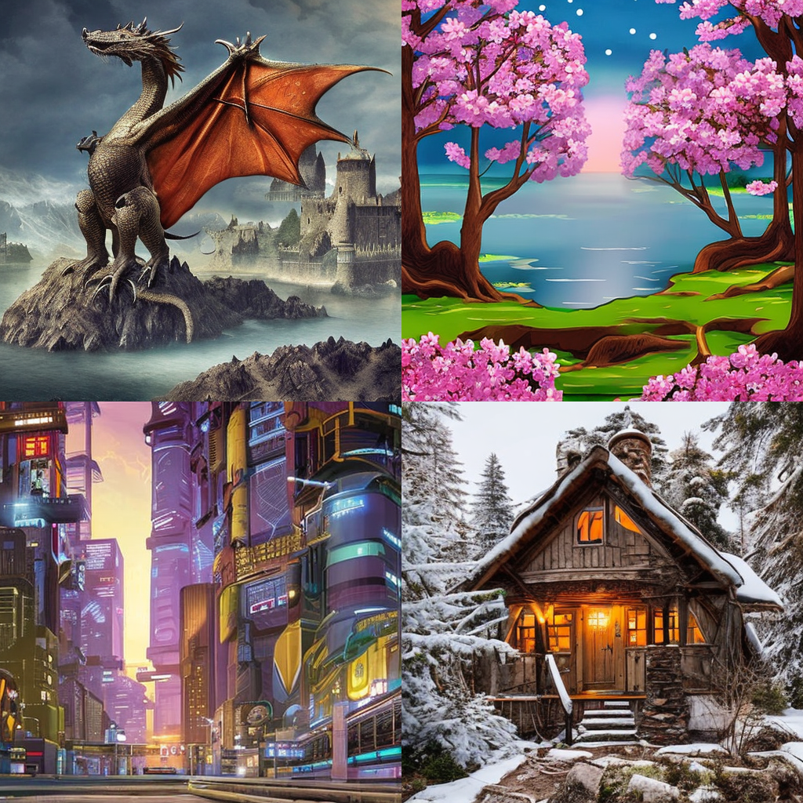
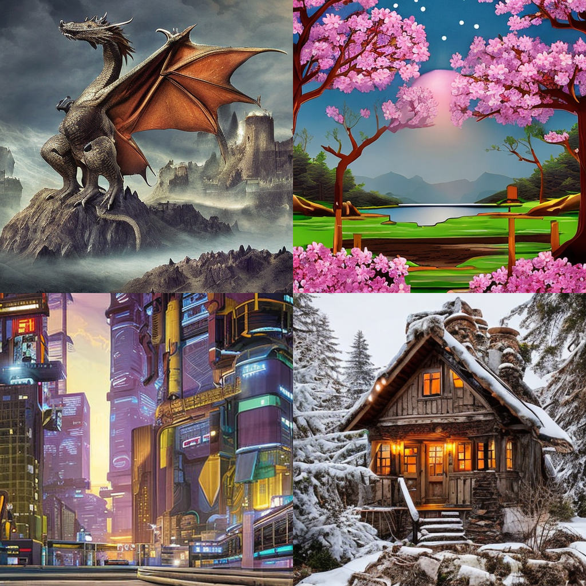
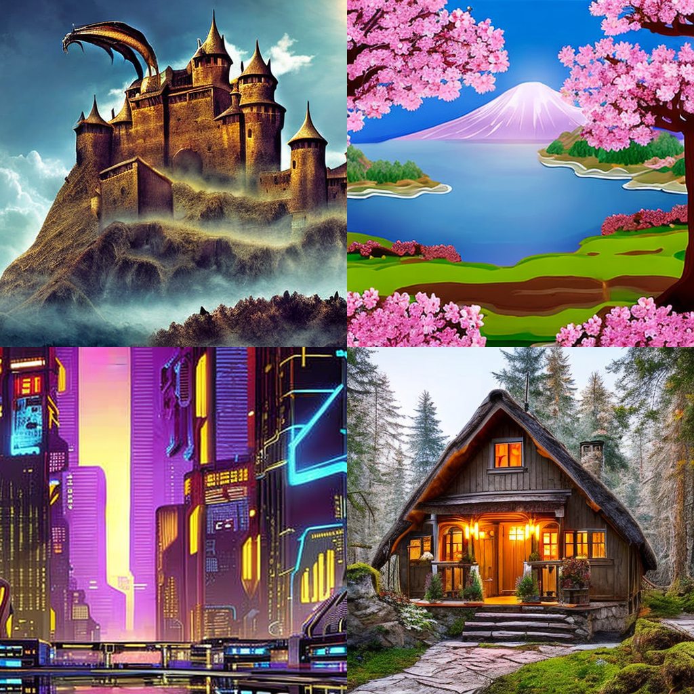
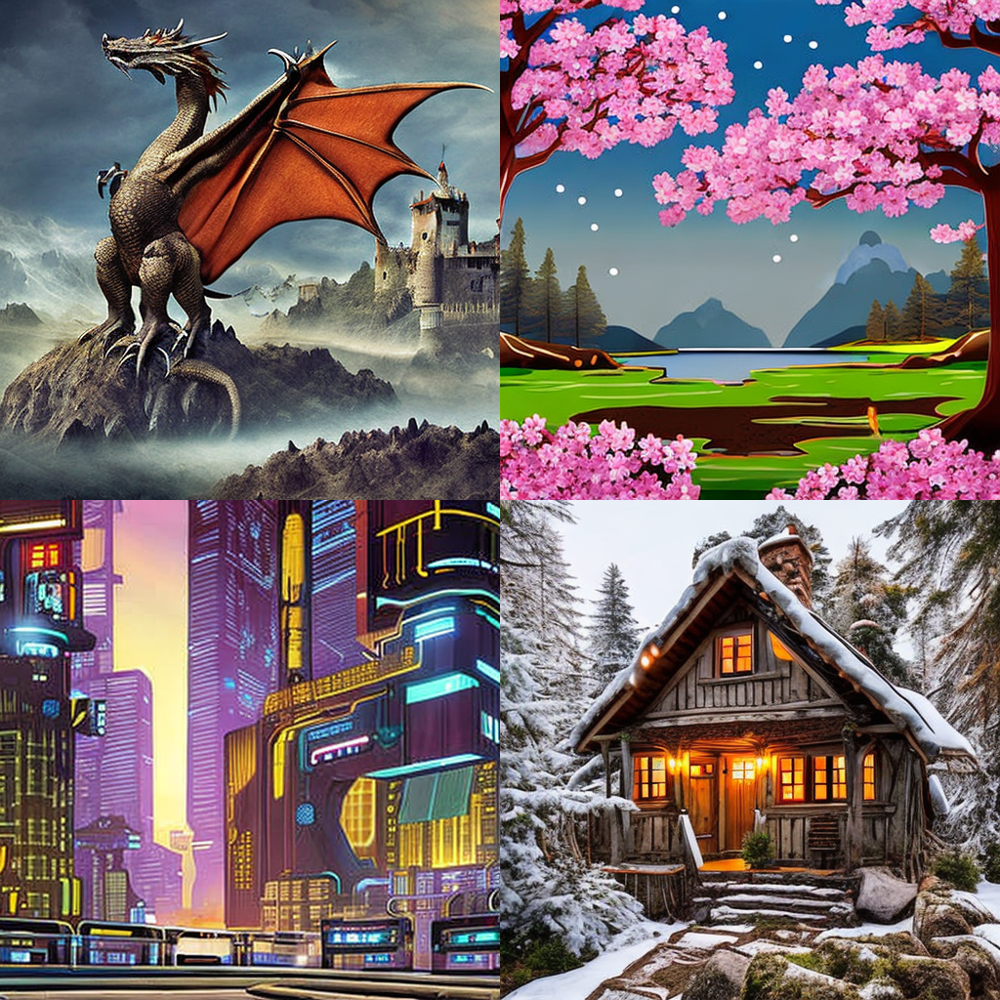
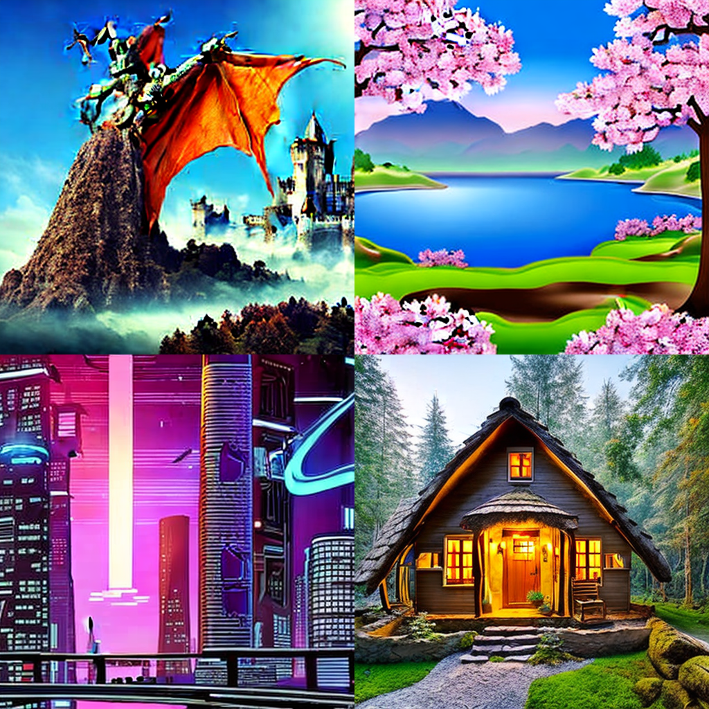
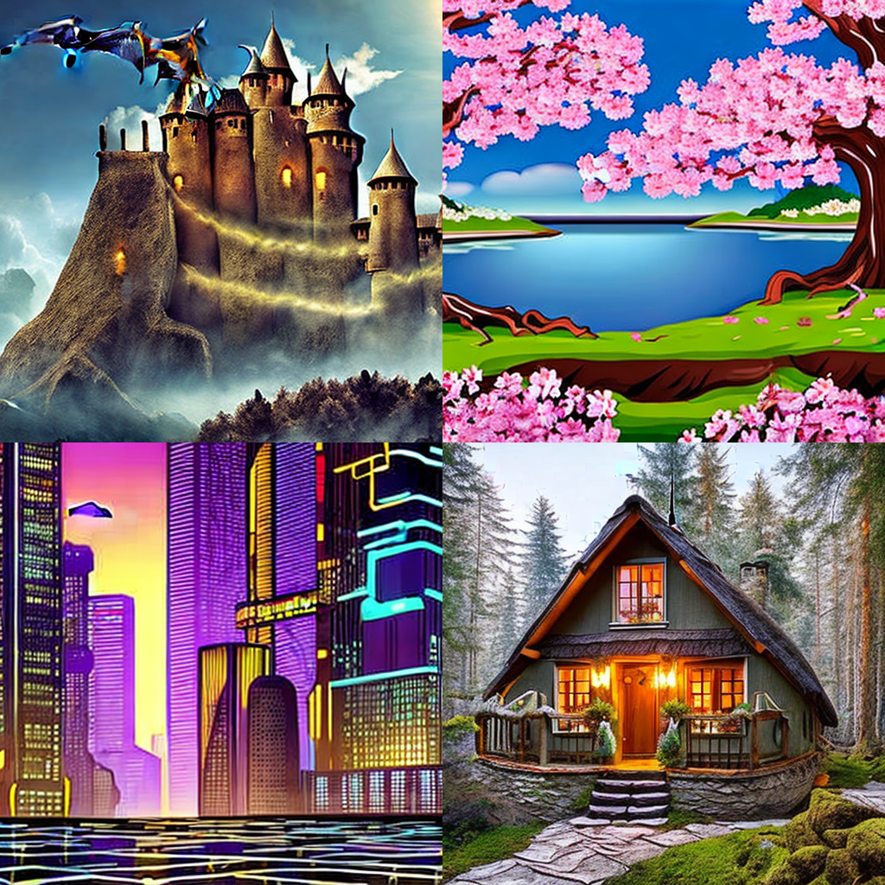

# minFDG

Unofficial Implementation of "Guidance in the Frequency Domain Enables High-Fidelity Sampling at Low CFG Scales"

## Visual Comparison

Below are comparison images generated using the same prompt with different methods and guidance scales:

### Low Guidance Scale (4)

| Method | Result |
|--------|--------|
| **CFG** |  |
| **FDG** |  |

### Medium Guidance Scale (8)

| Method | Result |
|--------|--------|
| **CFG** |  |
| **FDG** |  |


### High Guidance Scale (15)

| Method | Result |
|--------|--------|
| **CFG** |  |
| **FDG** |  |

## Installation

```bash
# Clone the repository
git clone https://github.com/yourusername/minFDG.git
cd minFDG

# Install dependencies
pip install -r requirements.txt
```

## Usage

### Basic Usage

```python
from sd_pipeline import StableDiffusionGenerator

# Initialize the generator
generator = StableDiffusionGenerator()

# Generate image with CFG (traditional method)
cfg_images = generator.generate_image_cfg(
    prompt="A beautiful sunset over mountains",
    guidance_scale=7.5,
    num_inference_steps=20
)

# Generate image with FDG (frequency domain guidance)
fdg_images = generator.generate_image_fdg(
    prompt="A beautiful sunset over mountains",
    guidance_scale=4.0,  # Much lower scale needed!
    num_inference_steps=20
)

# Save images
generator.save_images(cfg_images, output_dir="output", prefix="cfg")
generator.save_images(fdg_images, output_dir="output", prefix="fdg")
```

### Using the Main Interface

```python
# Use CFG method
images = generator(
    prompt="A majestic dragon flying over a castle",
    guidance_scale=7.5,
    use_fdg=False
)

# Use FDG method
images = generator(
    prompt="A majestic dragon flying over a castle",
    guidance_scale=7.5,  
    use_fdg=True
)
```

### Generate Comparison Grids

```python
# Generate a grid comparing different methods and scales
prompts = [
    "A serene lake with cherry blossoms",
    "A futuristic cityscape at night",
    "A cozy cottage in a magical forest"
]

# CFG grid
cfg_grid = generator.generate_image_grid(
    prompts=prompts,
    guidance_scale=7.5,
    use_fdg=False
)

# FDG grid
fdg_grid = generator.generate_image_grid(
    prompts=prompts,
    guidance_scale=7.5,
    use_fdg=True
)
```

## Parameters


### Guidance Scale Recommendations

For FDG, we choose $w_l < w_h$ (choose $w_l = \frac{1}{2} w_h$)

## Implementation Details

### Core Components

The implementation includes:

1. **StableDiffusionGenerator**: Main class with both CFG and FDG methods
2. **LaplacianPyramid Functions**: Helper functions for decompose high and low frequency


## Model

The implementation uses `stabilityai/stable-diffusion-2-1-base` by default.


